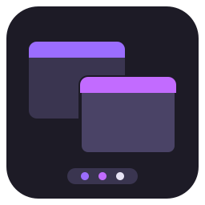

[](https://www.npmjs.com/package/@omnidyon/ngx-desktop)
[](https://www.npmjs.com/package/@omnidyon/ngx-desktop)
[](https://opensource.org/licenses/ISC)
[](https://github.com/omnidyon/ngx-desktop)

<a name="start"></a>

<p align="center">
  
  <br>
  <em>Ngx Desktop is an Angular library for desktop-style windows, widgets, a dock and dialogs in your Angular applications.</em>
  <br>
</p>

<p align="center">
  <a href="CONTRIBUTING.md">Contributing Guidelines</a>
  ·
  <a href="https://github.com/omnidyon/ngx-desktop/issues">Submit an Issue</a>
  ·
  <a href="./projects/ngx-desktop/README.md">Documentation</a>
</p>

**What you get**  
Draggable, resizable windows and widgets with snap-in-place and snap layouts, an optional no-overlap layout, a dock
with badges and pinned windows, dialogs, keyboard control, layouts that survive a reload, and themes you can change
with CSS variables.

Found this useful? [Star the repo](https://github.com/omnidyon/ngx-desktop)  
Need help integrating? [Book a consult](https://omnidyon.com/book)

## Documentation

### Full library documentation

If you need help on using Ngx Desktop please refer to the provided <a href="./projects/ngx-desktop/README.md">documentation</a>.
Changes per version are listed in the [changelog][changelog].

## Contributing

### Contributing Guidelines

Read through our [contributing guidelines][contributing] to learn about our submission process, coding rules, and more.

### Code of Conduct

Please read and follow our [Code of Conduct][codeofconduct].

## Development

### Development Setup

1. Fork the repo - see full <a href="https://docs.github.com/en/pull-requests/collaborating-with-pull-requests/working-with-forks/fork-a-repo">guide</a>.

2. Clone the repo - see full <a href="https://docs.github.com/en/pull-requests/collaborating-with-pull-requests/working-with-forks/fork-a-repo#cloning-your-forked-repository">guide</a>.

3. Go to the root of the library and install dependencies.

```bash
npm install
```

4. Run library in watch mode

```bash
npm run watch
```

5. Run the examples project

```bash
npm start
```

6. Run the tests

```bash
npm test        # unit tests
npm run e2e     # end-to-end tests in Chrome (normal and reduced motion)
```

**Found Ngx Desktop useful? Give the repo a star :star: :arrow_up:.**

[contributing]: CONTRIBUTING.md
[codeofconduct]: CODE_OF_CONDUCT.md
[documentation]: ./projects/ngx-desktop/README.md
[changelog]: CHANGELOG.md
